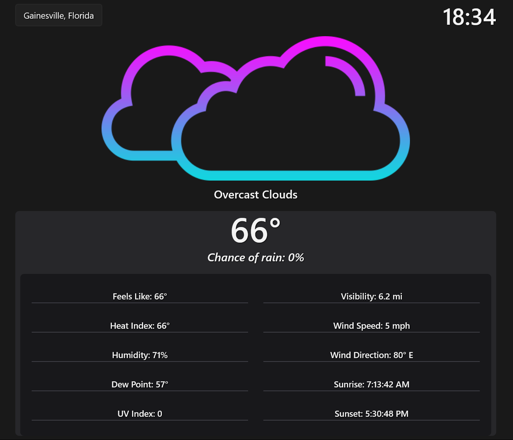

# Cloudy Weather

## Description

### **_Coming Soon!_**

Get ad-free, accurate, live weather powered by [Azure App Service](https://azure.microsoft.com/en-in/products/app-service/#overview) and the [CloudyWeather API](https://github.com/iiTONELOC/cloudyWeatherAPI).

## Screenshot

## DEMO

You can access the app at [https://iitoneloc.github.io/react-weather/](https://iitoneloc.github.io/react-weather/)

## Features

Cloudy Weather is a Single Page Web Application (SPA) for fetching current weather conditions and features the following technologies:

### Tech-Stack

| Technology  | Description                                                 | Links                                                                                                                             |
| ----------- | ----------------------------------------------------------- | --------------------------------------------------------------------------------------------------------------------------------- |
| TailwindCSS | Utility first CSS framework                                 | [TailwindCSS](https://tailwindcss.com/)                                                                                           |
| TypeScript  | Strongly typed programming language. Superset of JavaScript | [TypeScript](https://www.typescriptlang.org/)                                                                                     |
| JSX         | XML-like syntax for JavaScript                              | [JSX](<https://en.wikipedia.org/wiki/JSX_(JavaScript)>), [React - Introducing JSX](https://reactjs.org/docs/introducing-jsx.html) |
| React       | JavaScript library for UIs                                  | [React.js](https://reactjs.org/)                                                                                                  |
| RESTful API | CloudyWeatherAPI - an ASP.NET RESTful API service           | [CloudyWeatherAPI](https://github.com/iiTONELOC/cloudyWeatherAPI)                                                                 |

## How to Contribute

Not accepting contributions for this particular project, but if you wish to collaborate feel free to reach out!

## Contact

If you have any questions please feel free to email me @ [anthonytropeano@protonmail.com](mailto:anthonytropeano@protonmail.com)

## License

This project is licensed under the MIT License and a copy can be found here: [View License](./LICENSE)
